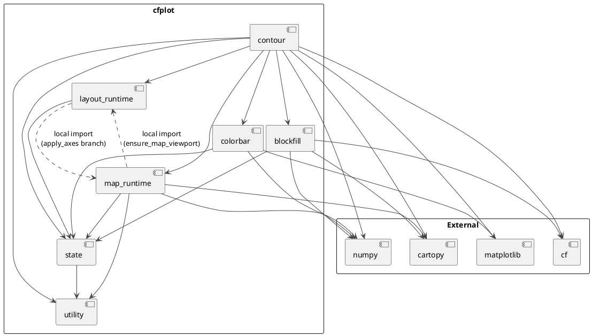
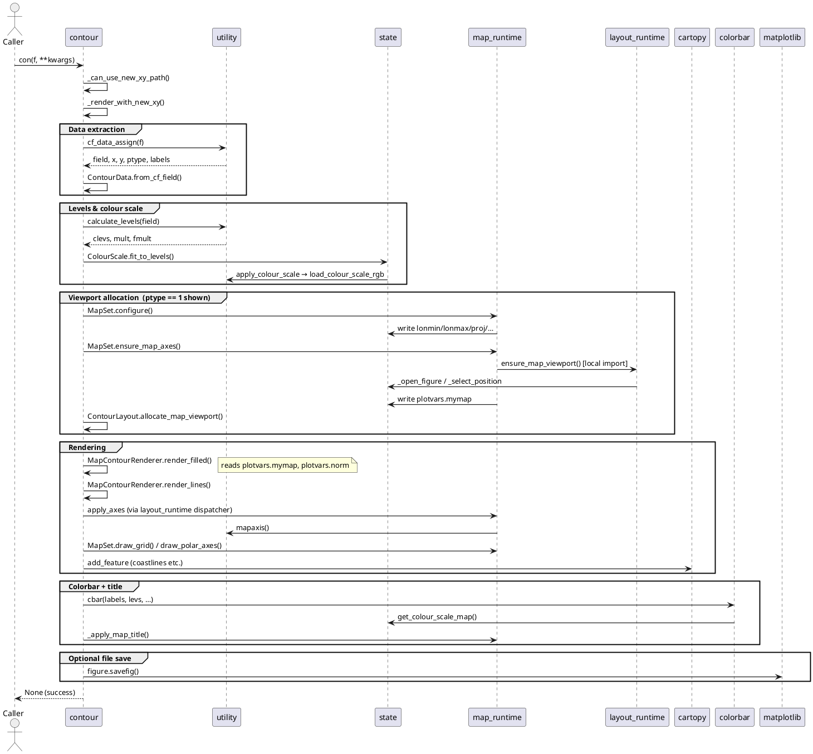

# cf-plot Contour Subsystem — Architecture & Refactoring Analysis

*Generated 2026-05-16. Covers the refactored contour path only (`contour.py` and its
direct dependencies). The legacy monolith `cfplot.py` is explicitly out of scope.*

---

## 1. Package Layout

```
cfplot/
├── __init__.py          # Public API surface
├── cfplot.py            # Legacy monolith (out of scope)
├── contour.py           # Refactored contour rendering
├── colorbar.py          # Colorbar rendering helper
├── blockfill.py         # Block-fill rendering helper
├── layout_runtime.py    # Figure/viewport lifecycle (no map knowledge)
├── map_runtime.py       # Map setup, axes, and graticule
├── state.py             # Global plotvars singleton + colour scale state
└── utility.py           # Pure stateless utilities
```

---

## 2. Module Responsibilities

### `state.py`
Owns the single shared `plotvars` instance and the two colour-scale operations
that mutate it (`apply_colour_scale`, `get_colour_scale_map`). Everything else that
reads or writes plotting state goes through this object.

**Imports:** `utility` (for `load_colour_scale_rgb`, `interpolate_colour_channels`).
This is the only outward dependency; `state` does not import any rendering module.

### `utility.py`
Pure functions with no global state. Acts as the maths and data-extraction layer:
`gvals`, `mapaxis`, `ndecs`, `calculate_levels`, `cf_data_assign`, `timeaxis`,
`find_z`, `load_colour_scale_rgb`, `interpolate_colour_channels`, etc.

**Imports:** nothing from the package.

### `layout_runtime.py`
Figure lifecycle and Cartesian viewport management. Contains:

| Symbol | Role |
|--------|------|
| `gopen` / `gclose` | Session open/close, figure save/show |
| `ensure_xy_viewport` | Lazy figure + subplot creation for Cartesian plots |
| `set_plot_limits` | Forward axis limits to the active `plotvars.plot` |
| `apply_axes` | Dispatcher: routes to `_apply_xy_axes` or (local import) `map_runtime._apply_map_axes` |
| `_open_figure` | Private: creates the Matplotlib figure, applies subplots_adjust |
| `_select_position` | Private: creates one subplot or user-positioned axes |
| `_apply_xy_axes` | Private: labels and ticks for Cartesian axes |

**Imports:** `matplotlib`, `state`. No Cartopy, no NumPy.

### `map_runtime.py`
Everything required to create and decorate a Cartopy map axes. Contains:

| Symbol | Role |
|--------|------|
| `MapSet` class | Stateful map configuration + axes creation |
| `MapSet.configure` | Write map extent/projection parameters into `plotvars` |
| `MapSet.ensure_map_axes` | Create the Cartopy `GeoAxes` subplot |
| `MapSet.draw_grid` | Draw a graticule on the active map |
| `MapSet.draw_polar_axes` | Graticule + longitude labels for polar stereographic |
| `_apply_map_title` | Places a title on map axes using Cartopy transforms |
| `_apply_dim_titles` | Places dimension-string annotation beside plot |
| `ensure_map_viewport` | Module-level: lazy figure creation before map axes |
| `_apply_map_axes` | Module-level: lon/lat ticks for cyl and lcc projections |

**Imports:** `cartopy.crs`, `numpy`, `utility`, `state`. Uses a *local* import of
`_open_figure`/`_select_position` from `layout_runtime` inside `ensure_map_viewport`
to avoid a circular module-level dependency.

### `colorbar.py`
Single public function `cbar()` that draws a `ColorbarBase` onto a newly-added axes
inset below or beside the active plot. Reads `plotvars` directly for defaults.

**Imports:** `matplotlib`, `numpy`, `state`.

### `blockfill.py`
Single public function `_bfill()` that fills contour bands with solid-coloured
rectangles or polygons. Handles both Cartesian and map (lon/lat) modes.

**Imports:** `cartopy.crs`, `cartopy.util`, `cf`, `matplotlib`, `numpy`, `state`.

### `contour.py`
The main rendering module. Provides `con()` as its sole public entry point.

**Key objects:**

| Object | Role |
|--------|------|
| `ContourData` | Frozen dataclass: extracted, validated field + coordinate arrays |
| `ContourLayout` | Allocates viewport and applies titles/labels |
| `ColourScale` | Fits a colormap to contour levels |
| `ContourRenderer` | Abstract base: `render_filled`, `render_lines`, `render_blockfill`, `render_colorbar` |
| `MapContourRenderer` | Concrete: Cartopy-aware contour drawing (ptype 1) |
| `XYContourRenderer` | Concrete: Cartesian contour drawing (ptypes 0, 2–5) |

**Key private functions:**

| Function | Role |
|----------|------|
| `con()` | Public entry point; guards unsupported cases, delegates to `_render_with_new_xy` |
| `_render_with_new_xy` | Orchestrates: data extraction → levels → colour → layout → render → colorbar → title |
| `_add_cyclic` | Adds a cyclic longitude column using `cartopy_util` |
| `_clear_animation_artists` | Removes artists from the previous animation frame |
| `_can_use_new_xy_path` | Guards entry to the new renderer path |

**Imports:** `cf`, `cartopy.crs`, `cartopy.feature`, `matplotlib`, `numpy`,
`utility`, `blockfill._bfill`, `colorbar.cbar`, `layout_runtime`, `map_runtime`,
`state`.

---

## 3. Dependency Diagram



---

## 4. Call Flow: a typical `con(f)` invocation



---

## 5. Semantic Leakage Analysis

The following issues are places where a module does work that belongs to a
different layer of the architecture. They are ordered roughly by severity and
ease of fixing.

---

### L1 — `_apply_map_title` and `_apply_dim_titles` moved to `map_runtime.py` (completed)

**Status (2026-05-16):** Completed. Both helpers now live in `map_runtime.py` and
`contour.py` calls them from there.

**What:** Two functions that place annotated text on map axes using Cartopy
coordinate transforms (`ccrs.PlateCarree`, `ccrs.Robinson`, etc.) are defined
as module-level privates in `contour.py`.

**Why it matters:** These are map annotation concerns. They have nothing to do
with the contour rendering strategy (levels, colourmaps, fill/lines). Their
natural home is `map_runtime.py`, alongside `draw_grid` and `draw_polar_axes`.

**Symptom in `ContourLayout`:** `ContourLayout.apply_title` branches on
`plot_type == 1` and calls `_apply_map_title`. This forces the *layout* class
to have knowledge of map projections — exactly the concern `map_runtime` is
supposed to own.

**Result:** Done. Ownership is now aligned: map annotations are in `map_runtime.py`.

---

### `rotated_runtime.py`
Rotated-pole (ptype 6) rendering and grid axes helpers. Encapsulates rotated-latitude-longitude
coordinate system rendering, including continent drawing via shapefile, rotated transforms,
and index-space grid lines/axis labels.

**Key functions:**

| Function | Role |
|----------|------|
| `_rotated_vloc` | Maps geographic lon/lat points into rotated-grid index space |
| `_render_rotated_grid_axes` | Draws rotated-pole graticule + continent lines in index space |
| `_render_ptype6_rotated_pole` | Handles rotated-pole plots (ptype 6) orchestration |

**Imports:** `cartopy.crs`, `cartopy.feature`, `numpy`, `utility`, `blockfill._bfill`,
`colorbar.cbar`, `layout_runtime`, `map_runtime`, `state`.

---

### L2 — `_render_rotated_grid_axes` and `_render_ptype6_rotated_pole` moved to `rotated_runtime.py` (completed)

**Status (2026-05-17):** Extraction complete. Both functions moved to `rotated_runtime.py`.
Post-move simplification:  extracted duplicated map feature decoration code into a
centralized `_apply_map_features()` helper in `map_runtime.py`, eliminating ~35 lines
of duplicate code in both `contour.py` and `rotated_runtime.py`.

**Result:** Done. Ptype-6 rendering has its own module with reduced duplication. Map
decoration logic is now centralized.

---

### L3 — `ColourScale.colorbar_labels` is dead code relative to the render path

**What:** `ColourScale` has a `colorbar_labels()` method implementing label-skip
and zero-centering logic. However, `_render_with_new_xy` never calls it; instead
it contains an equivalent (~50-line) inline implementation.

**Why it matters:** The method advertises a clean interface but is silently bypassed.
Any future caller that uses `ColourScale.colorbar_labels` will get different
behaviour from what `_render_with_new_xy` actually produces.

**Recommendation:** Either delete `colorbar_labels()` and canonise the inline logic,
or replace the inline logic with a call to `colorbar_labels()` and delete the
duplicate.

---

### L4 — `_add_cyclic` duplicated in `contour.py` and `blockfill.py`

**What:** Both modules define a private `_add_cyclic` helper that wraps
`cartopy_util.add_cyclic_point` with a float-rounding fallback. The two copies
are functionally identical.

**Recommendation:** Move to `utility.py` (which should grow a `cartopy` import)
or create a thin `_cartopy_helpers.py`. Both modules import the single canonical
copy.

---

### L5 — Renderer classes (`MapContourRenderer`, `XYContourRenderer`) bypass their injected dependencies and read `plotvars` directly

**What:** Both subclasses receive `layout`, `data`, and `colour_scale` in their
constructor, yet render methods reach back to `plotvars.mymap`, `plotvars.image`,
`plotvars.norm`, `plotvars.levels_extend`, etc.

**Why it matters:** The object design suggests the renderers are self-contained, but
at runtime they depend on global state being in the right shape. This makes testing
them in isolation hard and means the class boundaries are more cosmetic than real.

**Note:** This is a known cost of incremental refactoring. Fully fixing it requires
threading `mymap`, `norm`, etc. through the renderer interface, which is a larger
change. It should be tracked as a future goal rather than fixed immediately.

---

### L6 — Tick generation for ptypes 2–5 is inline in `_render_with_new_xy`

**What:** Approximately 80 lines of ptype-dispatch logic determines y-axis tick
marks for pressure, latitude, longitude, and time axes. This logic is embedded
directly in the 300-line `_render_with_new_xy` orchestration function.

**Why it matters:** Tick computation is a domain/axis concern, not an orchestration
concern. It makes the function hard to read and means the logic cannot be reused
(e.g. by a hypothetical `vec()` or `graph()` equivalent in the new architecture).

**Recommendation:** Extract to a `_compute_xy_ticks(data, kwargs, plotvars)` helper
in `utility.py` or a new `axis_helpers.py`.

---

### L7 — File-save block duplicated in `_render_with_new_xy` and `_render_ptype6_rotated_pole`

**What:** Both functions end with an identical "if `plotvars.file` and not session
open, then `figure.savefig` and close" block.

**Recommendation:** Extract to `layout_runtime.maybe_autosave()`. Both functions
call it once at the end.

---

### L8 — `colorbar.py` reads `plotvars` extensively for defaults

**What:** `cbar()` currently reads at least fifteen `plotvars` attributes to fill in
unset parameters (`rows`, `plot_type`, `proj`, `levels_extend`, `cs`, `norm`,
`image`, `master_plot`, etc.).

**Why it matters:** This makes `colorbar.py` tightly coupled to the state object
and hard to unit-test. It is the deepest legacy coupling left in the refactored
modules.

**Note:** Fixing this requires threading all the required values as explicit
arguments. It is the right long-term direction but is a substantial interface
change. For now the coupling is contained within `colorbar.py` and nowhere
else imports `colorbar` except through `contour.py`.

---

### L9 — `blockfill._bfill` ignores its `lonlat` parameter in favour of `plotvars.plot_type`

**What:** Despite accepting an explicit `lonlat` keyword, `_bfill` immediately
reassigns it from `plotvars.plot_type == 1`. The parameter is therefore
misleading and callers cannot override it.

**Recommendation:** Trust the caller's `lonlat` argument and remove the override
from the function body, or remove the parameter and make the plotvars read
explicit in the function's docstring.

---

## 6. Suggested Refactoring Order

| Priority | Item | Module(s) affected |
|----------|------|--------------------|
| 1 (low friction) | Fix L4: merge `_add_cyclic` into `utility` | `contour`, `blockfill`, `utility` |
| 2 (low friction) | Fix L7: extract `maybe_autosave` | `layout_runtime`, `contour` |
| 3 (medium) | Fix L3: remove dead `colorbar_labels` or use it | `contour` |
| 4 (done) | Fix L1: move `_apply_map_title` / `_apply_dim_titles` to `map_runtime` | `contour`, `map_runtime` |
| 5 (done) | Fix L2: extract rotated-pole path to `rotated_runtime` | `contour`, `rotated_runtime` |
| 6 (medium) | Fix L6: extract tick logic to `utility` or `axis_helpers` | `contour`, `utility` |
| 7 (larger) | Fix L9: honour `lonlat` parameter in `_bfill` | `blockfill` |
| 8 (future) | Fix L8: thread colorbar params explicitly | `colorbar`, `contour` |
| 9 (future) | Fix L5: decouple renderers from global `plotvars` | `contour` |
