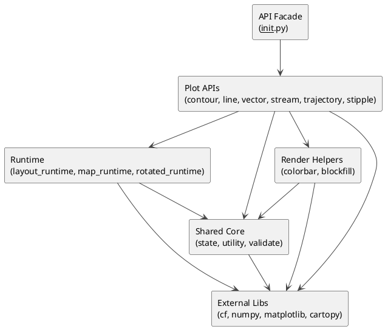
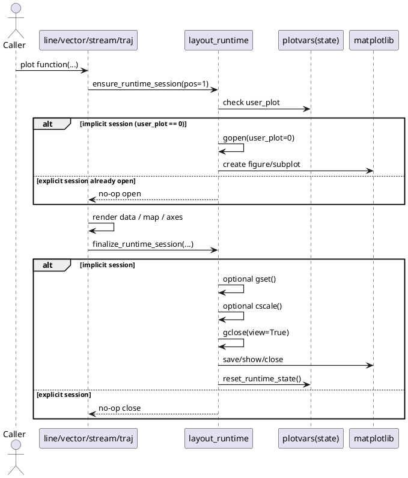
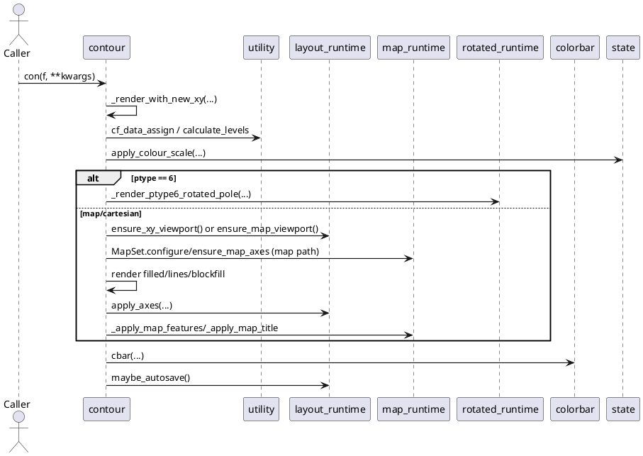

# cf-plot Runtime Architecture (Updated)

*Generated 2026-05-24. Captures the current modular plotting runtime after the
main/refactor26 merge and post-merge simplification phases.*

---

## 1. Scope

This document describes the current runtime architecture for plotting modules in
cfplot, including shared state, runtime/session orchestration, map runtime, and
plot-type modules:

- contour
- line
- vector
- stream
- trajectory
- stipple
- rotated runtime path for ptype 6

The legacy monolith file still exists in the repository but is not the primary
runtime path for the modules documented here.

---

## 2. Package Layout (Current)

```text
cfplot/
├── __init__.py          # Public API exports and reset orchestration
├── contour.py           # Main contour pipeline and renderer classes
├── layout_runtime.py    # Figure/session lifecycle and Cartesian axes helpers
├── map_runtime.py       # Projection/map setup, map axes, map features/titles
├── rotated_runtime.py   # Rotated-pole rendering and rotated grid axes
├── line.py              # lineplot API
├── vector.py            # vect API
├── stream.py            # stream API
├── trajectory.py        # traj API
├── stipple.py           # stipple overlay API
├── colorbar.py          # Colorbar drawing helper
├── blockfill.py         # Filled block rendering helper
├── state.py             # Shared plotvars + runtime reset state
├── utility.py           # Pure data/axis/colour utilities
├── validate.py          # Input shape and grid checks
├── colour/              # Colour scale loading and helpers
└── cfplot.py            # Legacy monolith (compatibility/legacy path)
```

---

## 3. Module Responsibilities

| Module | Responsibility |
|---|---|
| `__init__.py` | Public API surface and reset orchestration (`reset`, exports) |
| `state.py` | Single global shared state object (`plotvars`), defaults, runtime reset |
| `layout_runtime.py` | Open/close figures, implicit session management, Cartesian axis visibility |
| `map_runtime.py` | Projection configuration, map axes creation, map feature/axes/title helpers |
| `rotated_runtime.py` | Rotated pole rendering path and custom rotated grid axes drawing |
| `contour.py` | Main contour orchestration, contour renderer strategies, ptype routing |
| `line.py` | Line plotting and Cartesian axis setup |
| `vector.py` | Vector plotting over map/cartesian/rotated paths |
| `stream.py` | Streamline plotting on map path |
| `trajectory.py` | Trajectory plotting with optional legend/colorbar/vector segments |
| `stipple.py` | Overlay stippling for thresholded values |
| `utility.py` | Stateless helpers: levels, mapaxis, data extraction, interpolation, regrid |
| `validate.py` | Input-shape/grid validation checks |
| `colorbar.py` | Shared colorbar rendering |
| `blockfill.py` | Shared block-fill rendering |

---

## 4. Dependency Diagram (Current)

This simplified view shows the architectural layers and primary dependency
directions. Detailed per-module imports are intentionally omitted for
readability.

Source file: [docs/dev/uml/cfplot-runtime-simplified.pu](docs/dev/uml/cfplot-runtime-simplified.pu)



Legend:

- `API` is the stable public surface.
- `Plot APIs` coordinate user-facing plotting operations.
- `Runtime` provides shared session and map setup behavior.
- `Shared Core` holds state and stateless utility/validation logic.
- `Render Helpers` provide reusable rendering primitives.
- `External Libs` are foundational third-party dependencies.

---

## 5. Runtime Session Lifecycle (Current)

The plotting modules now use shared implicit session orchestration from
`layout_runtime`:

- `ensure_runtime_session(pos=1)`
- `finalize_runtime_session(...)`



---

## 6. Contour Call Flow (Current)



---

## 7. Notes On Current State

1. Shared runtime/session orchestration is now centralized in `layout_runtime`.
2. Map setup/axes/title/features are centralized in `map_runtime` and consumed
   by vector/stream/trajectory/contour paths.
3. Rotated pole rendering is isolated in `rotated_runtime` and called from
   contour/vector flows as required.
4. Runtime state reset is centralized through `state.reset_runtime_state()` and
   used by both package-level `reset()` and runtime `gclose()`.
5. Public API remains stable via exports in `__init__.py`.
